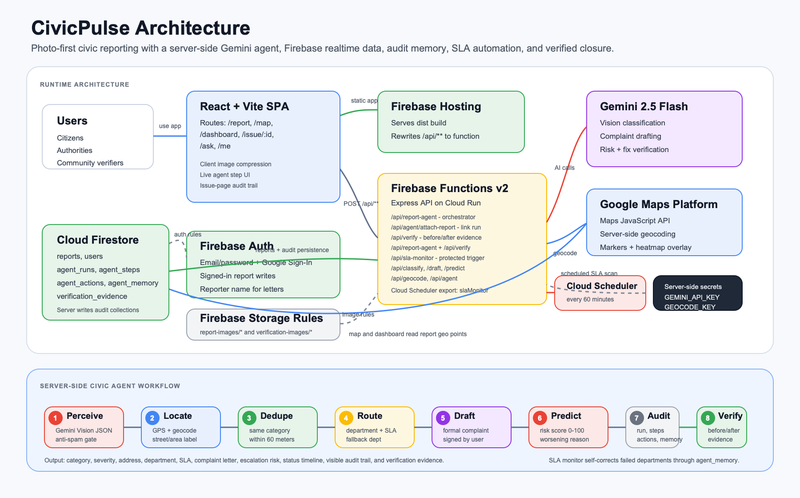

# CivicPulse — Report. Verify. Resolve. Together.

**AI-powered hyperlocal civic issue reporting platform.** A citizen snaps one photo of a local problem (pothole, broken streetlight, garbage, water leak…) and a 6-tool **Gemini AI civic agent** inspects it, locates it, removes duplicates, routes it to the right department, drafts the official complaint letter, and predicts how dangerous it gets if ignored. The community then verifies the fix with an after-photo — closing the loop most civic apps leave open.

Built for the **Vibe2Ship Hackathon** (CodingNinjas × Google for Developers) — Problem Statement 2: *"Community Hero: Hyperlocal Problem Solver."*

### 🔗 Links
- **Live app:** https://civicpulse-vibe2ship.web.app
- **Demo video:** https://youtu.be/4MNCGwz2ZZg
- **Team:** Aariz Rasheed

### Judge access
- **Email ID:** `judge@civicpulse.app`
- **Password:** `CivicPulse@2026`

Judges can also create a new email/password ID from the app if they want a fresh account.

---

## The 6-agent Civic Agent

When a citizen submits a photo, this pipeline runs live on screen — each step lights up as it completes:

| # | Agent | What it does | Tech |
|---|-------|--------------|------|
| 1 | **Perceive** | Gemini Vision confirms it's a genuine civic issue (rejects selfies/memes/indoor — anti-spam gate), categorizes it, and rates severity. | Gemini 2.5 Flash Vision |
| 2 | **Locate** | Gets GPS (with a permission rationale) and reverse-geocodes it into a worded street/area name. | Google Maps + `/api/geocode` |
| 3 | **Dedupe** | Detects a nearby existing report of the same category and offers to verify it instead of filing a duplicate. | Geospatial proximity |
| 4 | **Route** | Maps the category to the correct municipal department with an SLA. | Routing engine |
| 5 | **Draft** | Writes a formal, ready-to-send complaint letter signed with the citizen's real name. | Gemini 2.5 Flash |
| 6 | **Predict** | Forecasts escalation risk (0–100) so authorities prioritize the most dangerous issues. | Gemini 2.5 Flash |

**+ Loop closure:** when an issue is marked fixed, a citizen uploads an after-photo and Gemini Vision compares before/after to confirm the fix is genuine before it's marked *Verified Fixed*.
**+ Ask CivicPulse:** a Gemini function-calling assistant that answers questions about reported issues and impact, by voice or text.

---

## Features

- 📸 **Photo-first reporting** — one photo runs the whole agent pipeline
- 🗺 **Live issue map** — colored pins by category + hotspot heatmap, filterable by category/status
- 🏛 **Authority dashboard** — track issues through Reported → Acknowledged → In Progress → Resolved → Verified Fixed
- ✅ **Community fix-verification** — AI before/after photo comparison
- 🧾 **Visible agent audit trail** — every server-side run, step, action, and fix evidence is attached to the issue page
- 🏆 **Gamification** — civic points for reporting and verifying
- 🔐 **Firebase Auth** — email/password demo access, account creation, and Google Sign-In

---

## Tech stack

- **Frontend:** React + Vite + React Router (single-page app)
- **AI:** Google **Gemini 2.5 Flash** (Vision, structured JSON, function calling)
- **Maps:** Google Maps Platform (Maps JS API, reverse geocoding, custom heatmap)
- **Backend:** Express on **Google Cloud Run** (Cloud Functions v2) + Cloud Scheduler SLA monitor — a secure Gemini proxy that keeps the API key server-side
- **Data & Auth:** **Firebase** — Authentication (email/password + Google), Cloud Firestore (realtime), Storage rules, Hosting

### Architecture

A React SPA on **Firebase Hosting** calls a **Cloud Run** Express service (`/api/*`) that holds the Gemini key server-side — it's never exposed to the browser. Reports persist in **Cloud Firestore** in realtime, so the map and dashboard update instantly. Google Maps renders the live map and reverse-geocoding; Firebase Auth supports email/password accounts plus Google Sign-In and supplies the citizen's name for complaint letters.



```
React SPA (Firebase Hosting)
   │  /api/*  →  Cloud Run (Express)  →  Gemini 2.5 Flash
   │                                  →  /api/geocode (reverse geocoding)
   └─ Firestore (realtime reports) · Firebase Auth (email/password + Google) · Google Maps JS
```

---

## Local development

```bash
npm install

# Fill in your own keys (Firebase web config, Maps key, and GEMINI_API_KEY)
cp .env.example .env
cp functions/.env.example functions/.env

# Run the API proxy and the app in two terminals
npm run dev:api   # Express Gemini proxy on http://localhost:8787
npm run dev:web   # Vite app on http://localhost:5173
```

Required env vars (see [.env.example](.env.example)):
`VITE_FB_API_KEY`, `VITE_FB_AUTH_DOMAIN`, `VITE_FB_PROJECT_ID`, `VITE_FB_STORAGE_BUCKET`, `VITE_FB_SENDER_ID`, `VITE_FB_APP_ID`, `VITE_MAPS_KEY`, and `GEMINI_API_KEY`.

Optional server env vars:
`GEOCODE_KEY` or `MAPS_SERVER_KEY` for server-side reverse geocoding, and `SLA_MONITOR_KEY` to protect manual calls to `/api/sla-monitor`.

For Firebase deploys, set server-side keys in `functions/.env` from [functions/.env.example](functions/.env.example) or through your Firebase/Google Cloud secret workflow.

> 🔒 No secrets are committed — all `.env` files are git-ignored and the Gemini key is only ever used server-side.

## Agent audit collections

The server-side orchestrator records every meaningful AI decision in Firestore:

- `agent_runs` — one document per report triage, fix verification, or SLA monitor run.
- `agent_steps` — step-level status, latency, model output, and fallback/error metadata.
- `agent_actions` — route, duplicate, escalation, verification, and complaint-draft actions.
- `agent_memory` — state used for self-correcting SLA escalation and category routing memory.
- `verification_evidence` — before/after fix-verification evidence and model confidence.

Each linked report exposes this audit trail on the issue detail page so judges can inspect the server-side reasoning without opening Firebase Console. See [Agent Architecture](docs/AGENT_ARCHITECTURE.md) for the full workflow and [MTDB](docs/MTDB.md) for the Firestore/Storage data blueprint.

## Deploy

```bash
npm run build
firebase deploy --only functions,hosting,firestore:rules,storage
```

## Verification

```bash
npm run test:all
```

Or run individual checks:

```bash
npm run test:agent
npm run test:rules
npm run test:e2e
```

The agent test runs the orchestrator against an in-memory Firestore-shaped store to prove run logging, actions, fix evidence, and SLA self-correction without requiring local Firebase Admin credentials. The E2E suite checks the public app shell, map, dashboard, and email/password auth entry locally.

## License

MIT — see [LICENSE](LICENSE).

---

*Built by Aariz Rasheed for Vibe2Ship. Report. Verify. Resolve. Together.*
